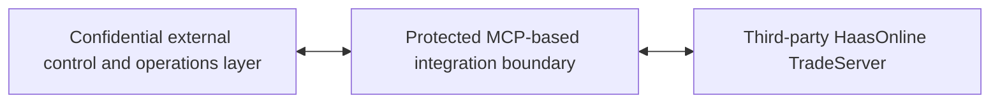

#  AI-Assisted TradeOps Control Plane — Black-Box Production Case
Public case by **Miguel Antonov**

This repository documents production scope, personal ownership and transferable engineering capability without publishing a reproducible product specification.

## Verified production facts

- Work period: 2023–present
- Hands-on production engineering since 2023
- More than two years of continuous private-project operation and client reporting
- Evidence pack spanning 11,900+ tested bot configurations/candidates and 589 selected candidates across documented reporting periods
- Approximately 60-node production infrastructure across Hetzner, Google Cloud, OneProvider, Vultr, DigitalOcean and Contabo, using Proxmox where applicable, Linux and containerized services
- HaasOnline TradeServer used as a third-party execution core
- HTS used as the first proven execution connector through an MCP-based integration boundary
- External AI/TradeOps control and operations layer designed, implemented and operated
- Connector and surrounding workflows validated in laboratory and production environments
- Quantitative research-to-production, Python data/AI, platform, reliability and operational ownership

The scale figures describe research and operating volume, not investment performance. Historical return figures are intentionally omitted.

## Broader technical and client-delivery foundation

- Hands-on programming foundation since 2008
- Linux/Bash foundation since 2010
- Algorithmic-trading domain experience since 2016
- HaasScript development and project-based private-user work since 2022
- Production engineering since 2023

These dates are kept separate: earlier technical and trading practice is not represented as continuous production-software employment.

## Public system boundary

The diagram proves responsibility boundaries only. It intentionally omits interfaces, commands, schemas, mappings, configuration logic, control flow and source code.

## Status boundary

**Production-proven**

- the HTS connector;
- the external control and operations layer;
- laboratory and production validation;
- the multi-server operating environment.

**Transferable delivery capability**

- additional execution connectors can be implemented when a target engine exposes suitable APIs or protocols and passes licensing, security and validation review.

This is not a claim that other connectors already exist or that every engine can be connected without paid engineering work.

## My role

I personally owned requirements discovery, product R&D, quantitative validation, systems architecture, implementation, testing, deployment, infrastructure operations, incident work, client communication and reporting.

HaasOnline TradeServer, its native GUI and its built-in capabilities are third-party technology and are not claimed as my development.

## Repository map

- [Case overview](docs/case-overview.md)
- [Ownership and third-party boundary](docs/ownership-and-third-party-boundary.md)
- [Production evidence summary](docs/production-evidence-summary.md)
- [Independent Haas service history](docs/independent-haas-service-history.md)
- [Reliability principles](docs/reliability-principles.md)
- [Connector portability](docs/connector-portability.md)
- [Disclosure policy](docs/disclosure-policy.md)
- [Copyright and third-party notice](NOTICE.md)

## What is intentionally not public

- commercial proposal and functional specification;
- detailed architecture or functional decomposition;
- MCP tool list, commands or call sequences;
- JSON schemas, mappings or control payloads;
- configuration and operational logic;
- source code and executable components;
- proprietary strategy logic;
- infrastructure identifiers and credentials;
- client reports, logs, runbooks, postmortems and security mechanisms;
- private Haas-client messages, code, strategies and results;
- investment-return claims.

Deeper evidence is available only through controlled interview review or qualified contractual disclosure.

## Contact

- LinkedIn: https://www.linkedin.com/in/miguel-antonov
- GitHub: https://github.com/xxxalf
- Email: [jast3618@gmail.com](mailto:jast3618@gmail.com)
- WhatsApp: https://wa.me/4915123551716
- Discord: `@x.01.001k`
